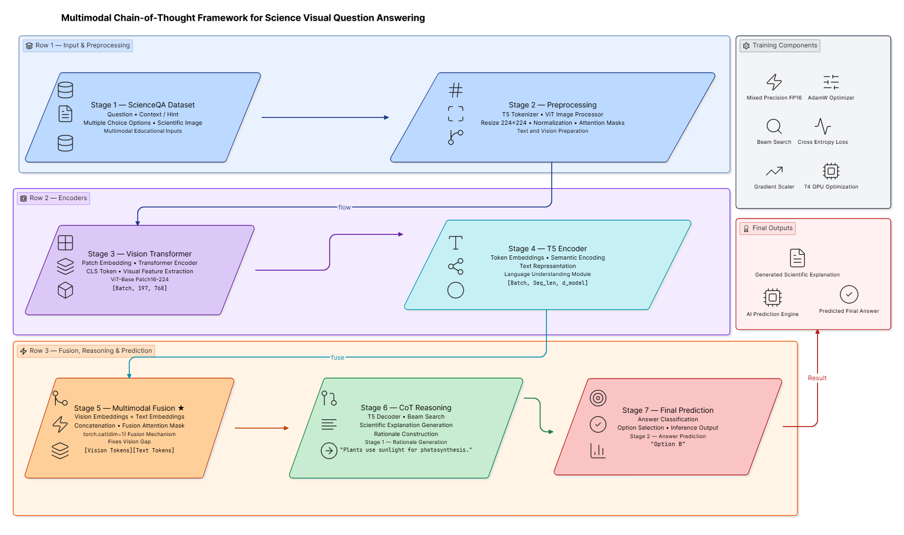

# 🧠 Unified Multimodal Chain-of-Thought Reasoning Framework

> **An Explainable Vision-Language AI Framework for Scientific and Commonsense Reasoning using BLIP-2, Chain-of-Thought, LoRA, and Parameter-Efficient Fine-Tuning.**





---

# 📖 Overview

This repository presents a **Unified Multimodal Chain-of-Thought (CoT) Reasoning Framework** that extends the original **Multimodal-CoT** architecture by integrating modern vision-language models, explainable AI techniques, and parameter-efficient fine-tuning.

The framework combines:

- 🖼️ Vision-Language Understanding
- 🧠 Chain-of-Thought Reasoning
- 🔍 Heuristic Answer Verification
- ✅ Rationale Consistency Validation
- 📚 Contextual Prompt Engineering
- ⚡ Parameter-Efficient Fine-Tuning (LoRA)
- 💾 4-bit Quantization
- 📊 Explainable AI (XAI)

The proposed system is evaluated on **ScienceQA** and **A-OKVQA** benchmark datasets for scientific and commonsense visual reasoning.

---

# 🎯 Project Motivation

Large Vision-Language Models often generate plausible answers without verifying whether their reasoning is logically consistent.

This project addresses that challenge by introducing a reasoning-aware inference pipeline that:

- Generates intermediate reasoning
- Verifies answer confidence
- Validates rationale consistency
- Improves explainability
- Reduces hallucinations

Instead of directly predicting an answer, the framework reasons first and verifies the prediction before producing the final output.

---

# 🏗️ System Architecture

```
                    Image
                      │
          Vision Encoder (ViT)
                      │
                  Q-Former
                      │
Question + Context ───┤
                      │
              Flan-T5 XL
                      │
      Chain-of-Thought Generation
                      │
      Heuristic Verification Layer
                      │
  Rationale Consistency Validation
                      │
            Final Answer Prediction
```

---

# 🚀 Key Features

✅ BLIP-2 Vision-Language Architecture

✅ Chain-of-Thought Reasoning

✅ Q-Former Vision-Language Alignment

✅ LoRA Parameter-Efficient Fine-Tuning

✅ 4-bit Quantization

✅ Gradient Accumulation

✅ Context-Aware Prompt Engineering

✅ ScienceQA + A-OKVQA Dataset Unification

✅ Heuristic Answer Verification

✅ Rationale Consistency Validation

✅ Explainable AI Pipeline

✅ Real Model Inference

---

# 🔬 Research Contributions

This work extends the original **Multimodal-CoT** framework through several research contributions:

- Unified multimodal reasoning architecture for scientific and commonsense reasoning.
- Context-aware prompt engineering using lecture and hint fusion.
- Parameter-efficient fine-tuning using LoRA adapters.
- Memory-efficient training with 4-bit quantization.
- Heuristic answer verification using probability-based scoring.
- Rationale consistency validation for explainable reasoning.
- Unified training pipeline for ScienceQA and A-OKVQA.
- Explainable inference with reasoning traceability.
- Real empirical evaluation using model inference.

---

# 🛠️ Technology Stack

| Category | Technologies |
|-----------|--------------|
| Programming | Python |
| Deep Learning | PyTorch |
| Vision-Language | BLIP-2 |
| Language Model | Flan-T5 XL |
| Vision Encoder | Vision Transformer (ViT) |
| Multimodal Bridge | Q-Former |
| Fine-Tuning | PEFT (LoRA) |
| Quantization | bitsandbytes (4-bit) |
| Libraries | Transformers, Datasets, Accelerate |
| Visualization | Matplotlib |
| Datasets | ScienceQA, A-OKVQA |

---

# 📂 Project Structure

```
Multimodal-Chain-of-Thought-Reasoning/

│
├── notebooks/
│   ├── Baseline.ipynb
│   ├── Modernized_BLIP2.ipynb
│
├── datasets/
│
├── outputs/
│
├── figures/
│
├── README.md
│
└── requirements.txt
```

---

# 📊 Experimental Results

| Dataset | Accuracy |
|----------|----------|
| ScienceQA | **68%** |
| A-OKVQA | **64%** |
| Combined | **66%** |

The framework demonstrates strong reasoning capability across both scientific and commonsense domains while maintaining transparent reasoning through rationale validation.

---

# 📈 Improvements over the Baseline

| Feature | Baseline | Proposed Framework |
|----------|-----------|-------------------|
| Backbone | T5 | BLIP-2 + Flan-T5 XL |
| Fusion | Linear Projection | Q-Former |
| Fine-Tuning | Full | LoRA |
| Precision | FP16 | 4-bit Quantized |
| Memory Usage | High | Low |
| Explainability | Limited | Rationale Validation |
| Verification | None | Heuristic Verification |
| Datasets | ScienceQA | ScienceQA + A-OKVQA |
| Evaluation | Standard | Empirical |

---

# 💡 Example Pipeline

```
Image
     +
Question
     +
Context

        │

        ▼

Vision Encoder

        ▼

Q-Former

        ▼

Flan-T5 XL

        ▼

Generate Chain-of-Thought

        ▼

Verify Candidate Answers

        ▼

Validate Reasoning

        ▼

Predict Final Answer
```

---

# 📚 Datasets

The framework is evaluated on:

### ScienceQA

- Scientific Question Answering
- Diagram Understanding
- Lecture Context
- Educational Reasoning

### A-OKVQA

- Commonsense Reasoning
- Visual Question Answering
- Real-world Knowledge
- Scene Understanding

---

# 🎯 Applications

- Explainable AI
- Educational AI
- Scientific Question Answering
- Visual Question Answering (VQA)
- Multimodal Large Language Models
- Vision-Language Research
- AI Research & Development

---

# 🔮 Future Work

- [ ] LLaVA Integration
- [ ] Qwen2.5-VL Support
- [ ] Phi-4 Multimodal
- [ ] Medical VQA
- [ ] RAG-based Reasoning
- [ ] Reinforcement Learning from Rationale Feedback
- [ ] Attention Visualization
- [ ] Hugging Face Model Release
- [ ] Gradio Web Demo

---

# 📖 Citation

If you find this work useful, please cite:

```bibtex
@misc{Ahmed2026,
  author = {Nauman Ahmed},
  title = {Unified Multimodal Chain-of-Thought Reasoning Framework},
  year = {2026},
  note = {Research Project},
}
```

---

# 👨‍💻 Author

**Nauman Ahmed**

AI Engineer | Machine Learning Engineer | Computer Vision | NLP | Multimodal AI | Large Language Models

📍 Islamabad, Pakistan

---

# ⭐ Support

If you found this project helpful:

⭐ Star the repository

🍴 Fork the project

🧠 Share your feedback

🤝 Contribute to future improvements

---

## 📜 License

This project is released under the MIT License.
